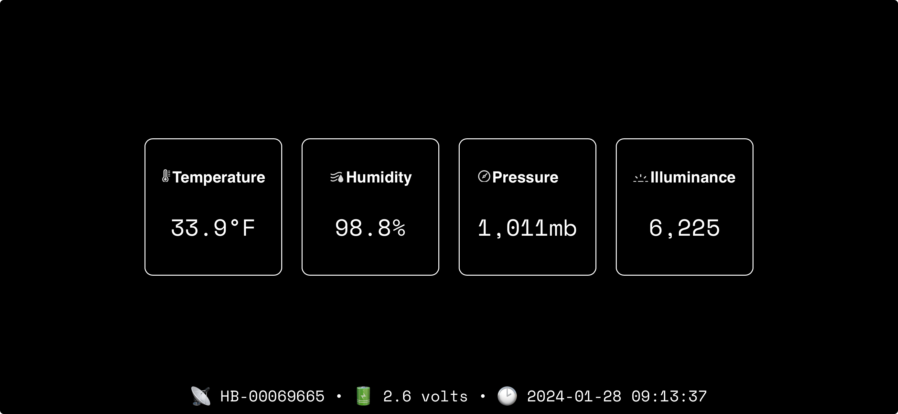
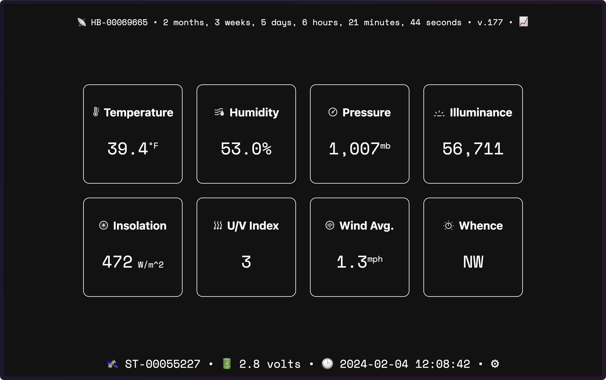

# Self-contained HTML Weatherflow Tempest Readings Display

## TODO

- [ ] Handle other Tempest UDP events
- [ ] Preferences form/route
- [ ] SQLite data logger option
  - [ ] Charts
  - [ ] Data export

## Build

```bash
$ # clone me
$ cd gofir
$ go build
```

## Run

On interrupt/control-c, the program cleans up after itself, but you can also terminate it remotely via the `/quit?token=something-you-make-up` endpoint:

```bash
$ SEEKRIT_TOKEN=something-you-make-up ./gofir
```

If you don't set `SEEKRIT_TOKEN` the `/quit` route will not be set up.

## WAT

This project builds a WIP self-contained Golang binary that presents current readings from a Weatherflow Tempest weather station to a web client. It is designed to be used as a full-screen display on a wall-mounted tablet or monitor.

Around five years go I got a few NuVision TMAX cheap 8" Windows tablets (~$50.00 USD). They're dinky (2GB RAM, 32GB slow SSD, Windows Home 10), but they can be used as a kiosk-mode display.

I've put off front-ending my Weatherflow Tempest HTML display project for this for way too long and decided to give it a go after re-finding a tablet whilst poking for something else.

After an arduous "it's been five years since your last Windows update" process, and getting Golang on the thing, this works pretty well.

It uses:

- [fir](https://github.com/livefir/fir/) which is a Go toolkit to build reactive web interfaces that uses [html/template](https://pkg.go.dev/html/template) and [alpinejs](https://alpinejs.dev/) under the hood
- code from my [go-weatherflow](https://github.com/hrbrmstr/go-weatherflow) for the UDP dance to listen for the local broadcasts.

{fir} is pretty neat! It uses websockets for comms and only updates the portions of the web page that have data changes.

**Windows** (tablet/Chrome)


**iOS**



**Arc** (dark mode)



**Safari** (light mode)


